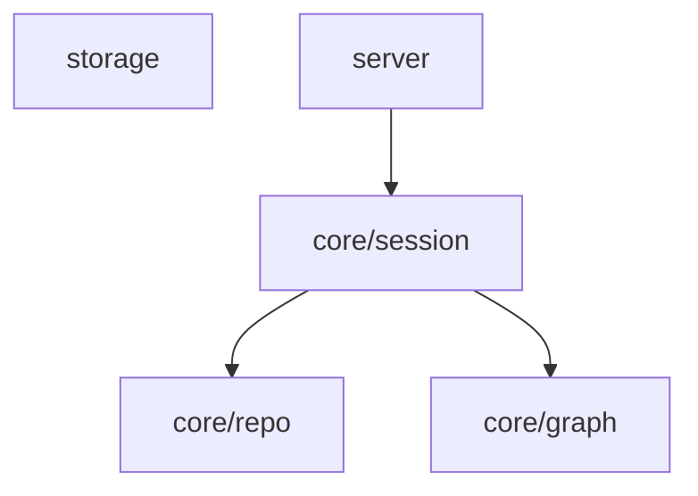

# Kairo v0.5.0 Dogfood Report

**Date:** 2026-05-19 · **Engine under test:** v0.5.0 → fixes shipped as **v0.5.1**
**Method:** the real compiled engine paths (`SessionManager.startSession`,
`scanRepo`, `graph`, `FileStorageAdapter` + redaction) driven by a harness over three
real repositories. No test doubles.

## Repos exercised

| Repo               | Role                                | Files | Source files | Raw import specifiers | Resolved internal edges |
| ------------------ | ----------------------------------- | ----: | -----------: | --------------------: | ----------------------: |
| **Kairo**          | small, clean TS                     |    76 |           54 |                   194 |                     139 |
| **colinhacks/zod** | medium TS (monorepo + Next.js docs) |   582 |          406 |                  1086 |                     504 |
| **nestjs/nest**    | large/messy TS monorepo             |  2117 |         1716 |                  6327 |                    3304 |

> Honest scope limit: all three are TS/JS-centric. The Python import path and the
> Go/other ecosystems were **not** exercised by this dogfood.

## Verdict

File-level import extraction and the durability/cache machinery are **solid**. The
**graph collapse layer had a critical bug** that made the module graph nearly useless
on the two commonest real layouts (monorepo, nested `src/`). Found, fixed, and
regression-tested in v0.5.1 before proceeding to v0.6.0 — exactly the reason this
gate exists.

## What worked (verified, not assumed)

- **Import extraction accuracy.** Kairo's own graph was checked edge-by-edge against
  known structure: `checkpointManager → continuationBuilder / riskEngine /
storageAdapter`, `continuationBuilder → reducer`, etc. — all correct. 194 raw
  specifiers → 139 resolved internal edges, no observed false edges.
- **`.js`→`.ts` NodeNext resolution** works on real code (Kairo uses it everywhere).
- **No-rescan behaviour proven.** Second fresh `SessionManager` returned
  `intelligenceFromCache=true` with an **identical `generatedAt`** (so no rescan
  happened, not merely "fast"): Kairo 42ms→1ms, zod 130ms→2ms, nest 405ms→1ms.
- **Cache invalidation honest.** A simulated pre-v0.5 cache (`schema:1`) was ignored
  (`getIntelligence()→undefined`) and regenerated at the current schema on all three.
- **Fingerprint sensitivity.** Adding one structural file flipped `changed=true` and
  the fingerprint on all three.
- **Truncation honesty.** nest's module graph hit the 40-node cap and was flagged
  `truncated: true` with the ⚠️ banner in the mirror — no silent partial graphs.
- **Performance.** First scan: 2117 files in ~405ms incl. import parsing of 1716
  source files; cached path 1–2ms. No file/parse caps hit on real repos. Non-issue.
- **Redaction boundary** held for the new `.kairo/graphs/*.md` mirrors.

## What was wrong — and fixed in v0.5.1

### BUG #1 (critical): module graph collapsed whole packages to one node

`groupOf()` stripped only a leading `packages/`, so `packages/zod/src/**` became the
single node `zod/src`. Every intra-package edge then became a self-edge and was
dropped.

| Repo  | file-level edges | module-graph edges BEFORE |                 AFTER (v0.5.1) |
| ----- | ---------------: | ------------------------: | -----------------------------: |
| zod   |              504 |                     **6** |              **11** (26 nodes) |
| nest  |             3304 |                     **7** |   **45** (40 nodes, truncated) |
| Kairo |              139 |                        48 | 48 (unchanged — no regression) |

**Fix:** locate the _deepest_ source segment (`src`/`lib`/`app`/`sources`) and group
by the owning package + directories _under_ that source root, so a package's internal
structure (and its edges) survives. Regression test added
(`packages/<pkg>/src/**` keeps `zod/types`, `zod/checks` distinct).

### BUG #2 (medium): architecture graph blind to `src/`-nested layers

It only inspected top-level dirs, so every project that nests layers under `src/`
(the common case, **including Kairo itself**) got the useless 0-edge fallback.

- Kairo architecture: **5 nodes / 0 edges (junk)** → **3 nodes / 2 edges**:
  `Interface → Domain → Data`.

**Fix:** added `RepoInventory.sourceDirs` (immediate children of a top-level source
root), bumped `INTELLIGENCE_SCHEMA` 2→3 (auto-invalidation, validated above), and
made `buildArchitectureGraph` consider source subdirs; added `server|cli|cmd|grpc`
to the Interface layer rule.

## Graph examples (post-fix)

**Kairo — module (good):**

**Kairo — architecture (now correct):** `Interface → Domain → Data`.

**nest — module (post-fix, honestly truncated):** 40 nodes / 45 edges, real package
nodes (`common`, `core`, `discovery`) with weighted cross-edges, ⚠️ truncation banner
present.

## False positives / known limitations (documented, not silently shipped)

- **Next.js `app/` router noise.** Treating `app` as a source root (correct for
  src-less Next.js projects) makes route-group folders (`(doc)`) and route-segment
  folders (`llms-full.txt/`) surface as graph nodes. These are _real directories_ —
  the graph is faithful — but for zod the docs site crowds the actual `zod/**`
  library nodes. Not a correctness bug; a salience/ranking limitation.
- **Example-heavy monorepos.** nest is mostly `sample/` + `integration/`; the graph
  honestly reflects that the repo is dominated by examples, which buries the core
  packages. Truncation is flagged honestly but ranking is naïve.
- **Flat package source = one node.** `packages/zod/src/*.ts` with no subdirs
  collapses to a single `zod` node — inherent to directory collapse, not a defect.
- **Bare / workspace / dynamic imports excluded by design** (`@nestjs/common`,
  `import(expr)`). Correct per the documented scope, but cross-package edges in
  workspace-aliased monorepos are therefore not drawn.
- **Service/architecture graphs are low-value for libraries** (zod). Expected;
  each graph is annotated "heuristic".
- **Python/Go not dogfooded.** No evidence either way for those resolvers yet.

## Performance notes

| Repo  | first scan (incl. import parse) | cached start | module-graph build                |
| ----- | ------------------------------: | -----------: | --------------------------------- |
| Kairo |                           42 ms |         1 ms | negligible                        |
| zod   |                          130 ms |         2 ms | negligible                        |
| nest  |                          405 ms |         1 ms | negligible (3304 edges collapsed) |

Caps (`maxFiles 20000`, `MAX_PARSED_FILES 6000`, `maxNodes 40`) were appropriate; only
the _node_ cap engaged (nest), and it did so honestly.

## Improvements recommended before / during v0.6.0 (Vector Memory)

These do **not** block v0.6.0 but directly affect the quality of signals vector
memory will embed:

1. **Node salience ranking.** When truncating, prefer first-party source
   (`src/`, `packages/<pkg>/src`) over `sample/`, `examples/`, `fixtures/`, `docs/`.
   This is the single highest-leverage improvement for graph usefulness.
2. **Down-rank generated/site dirs** (`docs` Next.js apps, route folders) so library
   structure leads the graph.
3. **Optional workspace-alias resolution** (`tsconfig.json#paths`,
   `package.json#workspaces`) to recover cross-package edges in aliased monorepos.
4. **Exercise the Python resolver** on a real Python repo before vector memory
   ingests Python projects.
5. Consider emitting an **intra-group cohesion count** so collapsed self-edges are
   represented as a number rather than silently dropped.

## Conclusion

v0.5.0 shipped a real correctness bug in the graph collapse layer that would have fed
weak structural signals into vector memory. It was caught here, fixed in **v0.5.1**,
re-validated on all three repos, and covered by regression tests (62 passing).
File-level extraction, caching, invalidation, truncation honesty, and performance are
sound. The documented limitations are salience/ranking issues, not correctness — safe
to proceed to v0.6.0 with improvement #1 prioritised.
